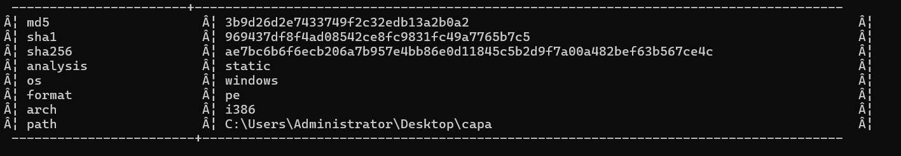
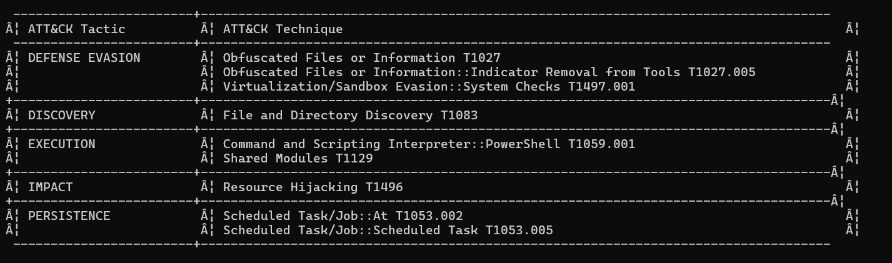

# CAPA: The Basics

## Task 01: Introduction

### Description

- There are two types of analysis: dynamic analysis and static analysis.
- CAPA (Common Analysis Platform for Artifacts) is a tool developed by the FireEye Mandiant team.
-  It is designed to identify the capabilities present in executable files like Portable Executables (PE), ELF binaries, .NET modules, shellcode, and even sandbox reports.
-  The beauty of CAPA is that it encapsulates years of reverse engineering knowledge into an automated tool, making it accessible even to those who may not be experts in reverse engineering.

## Task 02: Tool Overview:How CAPA Works

### Description

- Run the tool in powershell: C:\Users\Administrator\Desktop\capa> capa.exe .\cryptbot.bin

#### Question

What command-line option would you use if you need to check what other parameters you can use with the tool? Use the shortest format.

#### Answer

-h

#### Question

What command-line options are used to find detailed information on the malware's capabilities? Use the shortest format.

#### Answer

-v

#### Question

What command-line options do you use to find very verbose information about the malware's capabilities? Use the shortest format.

#### Answer

-vv

#### Question

What PowerShell command will you use to read the content of a file?

#### Answer

Get-Content

## Task 03: Dissecting CAPA Results Part 1:General Information,MITRE and MAEC

### Description

- The arch field allows us to determine whether we are dealing with a binary related to x86 architecture.
- MITRE ATT&CK  functions as a strategic playbook, providing detailed insights into attackers' methods, from gaining initial access to maintaining a presence, escalating privileges, evading defenses, moving laterally within a network, and much more.
- ATT&CK Tactic::ATT&CK Technique::Technique Identifier and ATT&CK Tactic::ATT&CK Technique::ATT&CK Sub-Technique::Technique Identifier[.]Sub-technique Identifier.
- MAEC(Malware Attribute Enumeration and Characterization) is a specialized language designed to encode and communicate complex details concerning malware.
- When CAPA tags a file with a “launcher” MAEC value, it indicates that the file demonstrates behaviour similar to but not limited to:
1. Dropping additional payloads
2. Activating persistence mechanisms
3. Connecting to command-and-control (C2) servers
4. Executing specific functions
- When CAPA tags a file with a “Downloader” MAEC value, it indicates that the file demonstrates behaviour similar but not limited to:
1. Fetching additional payloads or resources from the internet
2. pulling in updates
3. executing secondary stages
4. retrieving configuration files

#### Question

What is the sha256 of cryptbot.bin?

#### Answer

 ae7bc6b6f6ecb206a7b957e4bb86e0d11845c5b2d9f7a00a482bef63b567ce4c

#### Question

What is the Technique Identifier of Obfuscated Files or Information?

#### Answer

 T1027  

#### Question

What is the Sub-Technique Identifier of Obfuscated Files or Information::Indicator Removal from Tools?

#### Answer

T1027.005 

#### Question

When CAPA tags a file with this MAEC value, it indicates that it demonstrates behaviour similar to, but not limited to, Activating persistence mechanisms?

#### Answer

launcher

#### Question

When CAPA tags a file with this MAEC value, it indicates that the file demonstrates behaviour similar to, but not limited to, Fetching additional payloads or resources from the internet?

#### Answer

Downloader

## Task 04: Dissecting CAPA Results Part 2:Malware Behavior Catalogue

### Description

- Malware Behavior Catalogue (MBC) is designed to support various aspects of malware analysis, such as labelling, similarity analysis, and standardized reporting.
- OBJECTIVE::Behavior::Method[Identifier] and OBJECTIVE::Behavior::[Identifier]

#### Question

What serves as a catalogue of malware objectives and behaviours?

#### Answer

#### Question

 Which field is based on ATT&CK tactics in the context of malware behaviour?

#### Answer

#### Question

What is the Identifier of "Create Process" micro-behavior?

#### Answer

#### Question

What is the behaviour with an Identifier of B0009?

#### Answer

#### Question

Malware can be used to obfuscate data using base64 and XOR. What is the related micro-behavior for this?

#### Answer

#### Question

Which micro-behavior refers to "Malware is capable of initiating HTTP communications"?

#### Answer
