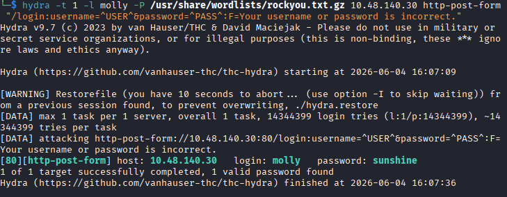
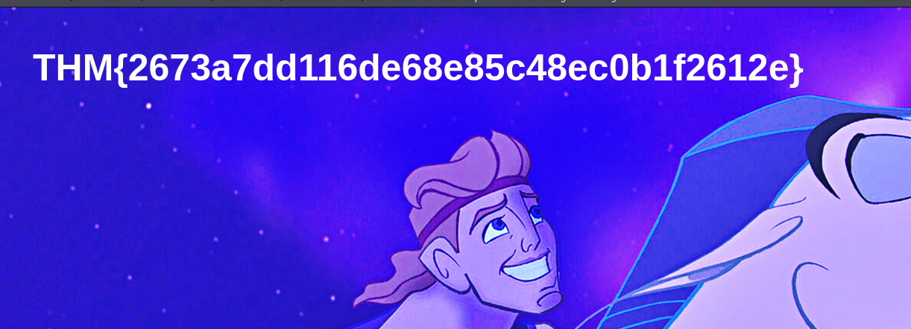
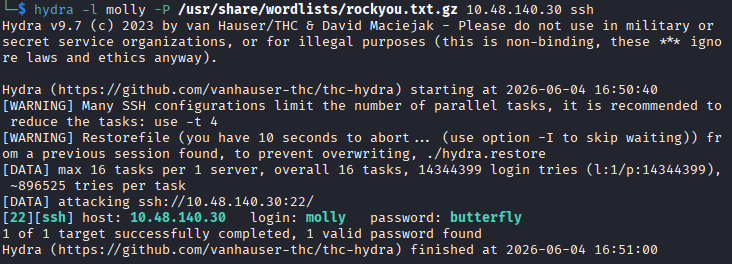
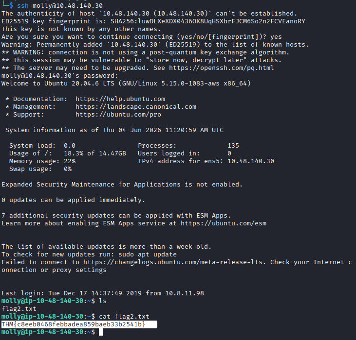

# Hydra

## Task 1: Hydra Introduction

### Description

- Hydra  is a brute force online password cracking program.
- Official repositiry : https://github.com/vanhauser-thc/thc-hydra

## Task 2: Using Hydra

### Description

-  If we wanted to brute force FTP with the username being user and a password list being passlist.txt, we’d use the following command: hydra -l user -P passlist.txt ftp://MACHINE_IP
-  For SSH: hydra -l <username> -P <full path to pass> MACHINE_IP -t 4 ssh
-  Post Web Form: hydra -l <username> -P <wordlist> MACHINE_IP http-post-form "<path>:<login_credentials>:<invalid_response>"
-  If the web server is listening on a non-default port number : hydra -l <username> -P <wordlist> MACHINE_IP http-post-form "/:username=^USER^&password=^PASS^:F=incorrect" -s <port> -V

#### Question

Use Hydra to brute-force molly's web password. What is the value of flag 1?

#### Answer

THM{2673a7dd116de68e85c48ec0b1f2612e}

#### Question

Use Hydra to brute-force molly's SSH password. What is the value of flag 2?

#### Answer

THM{c8eeb0468febbadea859baeb33b2541b}

