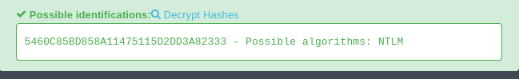
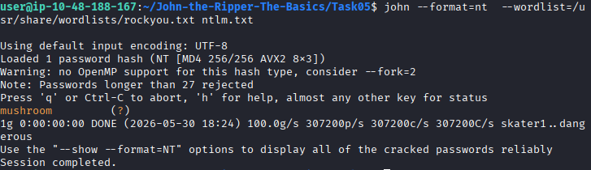
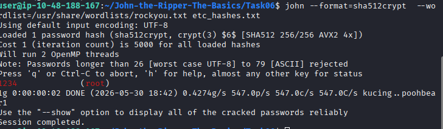
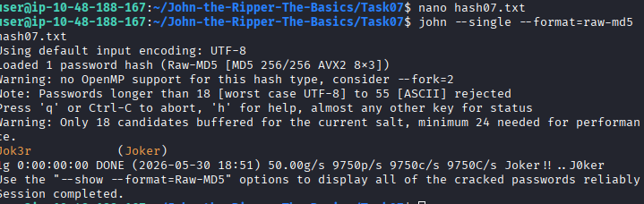
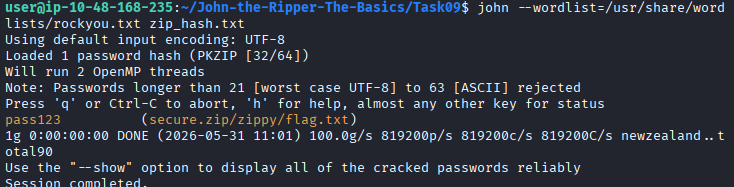
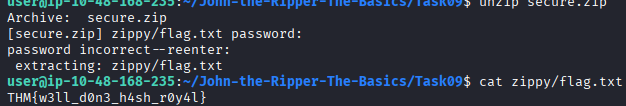
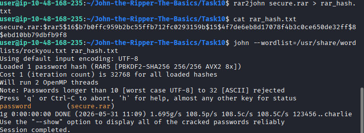
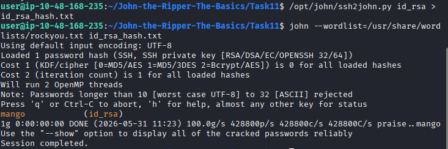

# John the Ripper

## Overview

This writeup documents my learning experience while completing the TryHackMe "John the Ripper: The Basics
" room. This room focus on the most popular extended version of John the Ripper, Jumbo John.

## Room Tasks

### Task 1: Introduction

#### Key Concepts

- John the Ripper is a password-cracking tool.
- Supports multiple hash formats.
- Commonly used in penetration testing and security auditing.

### Task 2: Basic Terms

#### Key Concepts

- A hash converts data into a fixed-length value.
- Hashing is a one-way process. The algorithm to hash the value is "P" , while unhashing algorithm is "NP".
- John the Ripper uses dictionary and brute-force attacks.

#### Question

What is the most popular extended version of John the Ripper?

#### Answer

Jumbo John

### Task 3: Setting Up Your System

#### Question

Which website’s breach was the rockyou.txt wordlist created from?

#### Answer

rockyou.com

### Task 4: Cracking Basic Hashes

#### Key Concepts

- Basic Syntax: john [options] [file path]
- For automatic Cracking: john --wordlist=[path to wordlist] [path to file]
- Hash Identifier: wget https://gitlab.com/kalilinux/packages/hash-identifier/-/raw/kali/master/hash-id.py       $ python3 hash-id.py
- Format Specific Cracking: john --format=[format] --wordlist=[path to wordlist] [path to file]

#### Question

What type of hash is hash1.txt?

#### Answer

md5

#### Question

What is the cracked value of hash1.txt?

#### Answer

biscuit

#### Question

What type of hash is hash2.txt?

#### Answer

sha1

#### Question

What is the cracked value of hash2.txt?

#### Answer

kangeroo

#### Question

What type of hash is hash3.txt?

#### Answer

sha256

#### Question

What is the cracked value of hash3.txt?

#### Answer

microphone

#### Question

What type of hash is hash4.txt?

#### Answer

whirlpool

#### Question

What is the cracked value of hash4.txt?

#### Answer

colossal

### Task5: Cracking Windows Authentication Hashes

#### Key Concepts

- NThash is the hash format modern Windows operating system machines use to store user and service passwords.
- Also referred as NTLM.

#### Question

What do we need to set the --format flag to in order to crack this hash?

#### Answer

nt

#### Question

What is the cracked value of this password?

#### Answer

mushroom

### Task6: Cracking Hashes from /etc/shadow

#### Key Concepts

- unshadow [path to passwd] [path to shadow]
- FILE 1 - local_passwd
  Contains the /etc/passwd line for the root user
-FILE 2 - local_shadow
  Contains the /etc/shadow line for the root user

#### Question

What is the root password?

#### Answer

1234

### Task7: Single Crack Mode

#### Key Concepts

- john --single --format=[format] [path to file]
- Prepend the hash with the username that the hash belongs to.

#### Question

What is Joker’s password?

#### Answer

Jok3r

### Task8: Custom Rules

#### Key Concepts

- Az: Takes the word and appends it with the characters you define
- A0: Takes the word and prepends it with the characters you define
- c: Capitalises the character positionally
- john --wordlist=[path to wordlist] --rule=[set of rules customized] [path to file]

#### Question

What do custom rules allow us to exploit?

#### Answer

Password complexity predictability

#### Question

What rule would we use to add all capital letters to the end of the word?

#### Answer

Az"[A-Z]"

#### Question

What flag would we use to call a custom rule called THMRules?

#### Answer

--rule=THMRules

### Task9: Cracking Password Protected Zip File

#### Key Concepts

- zip2john [options] [zip file] > [output file]

#### Question

What is the password for the secure.zip file?

#### Answer

Pass123

#### Question

What is the contents of the flag inside the zip file?

#### Answer

THM{w3ll_d0n3_h4sh_r0y4l}

### Task10: Cracking Password Protected RAR Archives

#### Key Concepts

- rar2john [rar file] > [output file]

#### Question

What is the password for the secure.rar file?

#### Answer

password

#### Question

What are the contents of the flag inside the rar file?

#### Answer

THM{r4r_4rch1ve5_th15_t1m3}

### Task11: Cracking SSH Keys with John

#### Key Concepts

- ssh2john [id_rsa private key file] > [output file]
- If you don’t have ssh2john installed,use  python /usr/share/john/ssh2john.py

#### Question

What is the SSH private key password?

#### Answer

mango

## References

- TryHackMe
- John the Ripper Documentation
