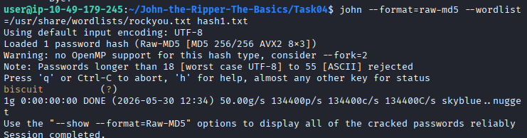
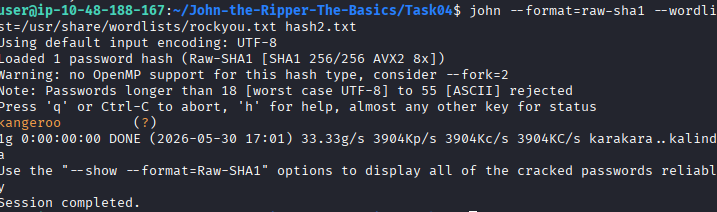
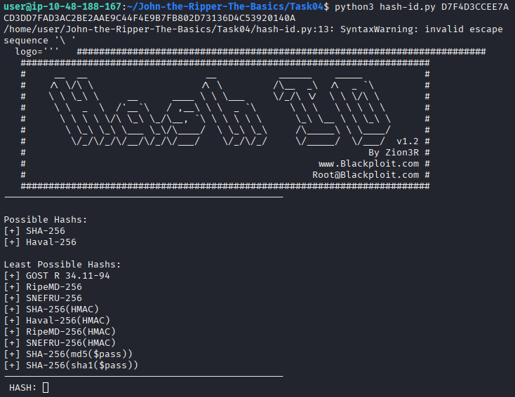
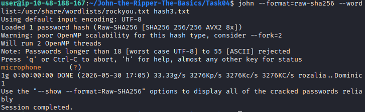
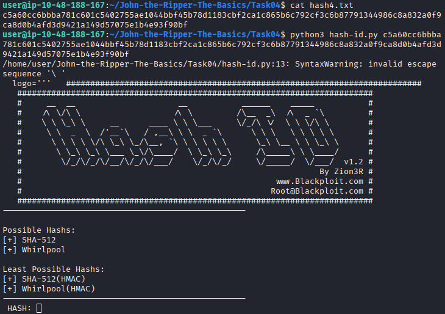
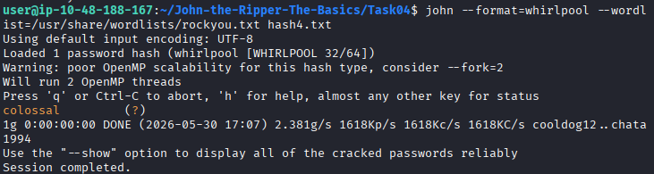

# John the Ripper

## Overview

This writeup documents my learning experience while completing the TryHackMe "John the Ripper: The Basics
" room. This room focus on the most popular extended version of John the Ripper, Jumbo John.

## Room Tasks

### Task 1: Introduction

#### Key Concepts

- John the Ripper is a password-cracking tool.
- Supports multiple hash formats.
- Commonly used in penetration testing and security auditing.

### Task 2

#### Key Concepts

- A hash converts data into a fixed-length value.
- Hashing is a one-way process. The algorithm to hash the value is "P" , while unhashing algorithm is "NP".
- John the Ripper uses dictionary and brute-force attacks.

#### Question

What is the most popular extended version of John the Ripper?

#### Answer

Jumbo John

### Task 3

#### Question

Which website’s breach was the rockyou.txt wordlist created from?

#### Answer

rockyou.com

### Task 4

#### Key Concepts

- Basic Syntax: john [options] [file path]
- For automatic Cracking: john --wordlist=[path to wordlist] [path to file]
- Hash Identifier: wget https://gitlab.com/kalilinux/packages/hash-identifier/-/raw/kali/master/hash-id.py       $ python3 hash-id.py
- Format Specific Cracking: john --format=[format] --wordlist=[path to wordlist] [path to file]

#### Question

What type of hash is hash1.txt?

#### Answer

md5

#### Question

What is the cracked value of hash1.txt?

#### Answer

biscuit

#### Question

What type of hash is hash2.txt?

#### Answer

sha1

#### Question

What is the cracked value of hash2.txt?

#### Answer

kangeroo

#### Question

What type of hash is hash3.txt?

#### Answer

sha256

#### Question

What is the cracked value of hash3.txt?

#### Answer

microphone

#### Question

What type of hash is hash4.txt?

#### Answer

whirlpool

#### Question

What is the cracked value of hash4.txt?

#### Answer

colossal

## References

- TryHackMe
- John the Ripper Documentation
