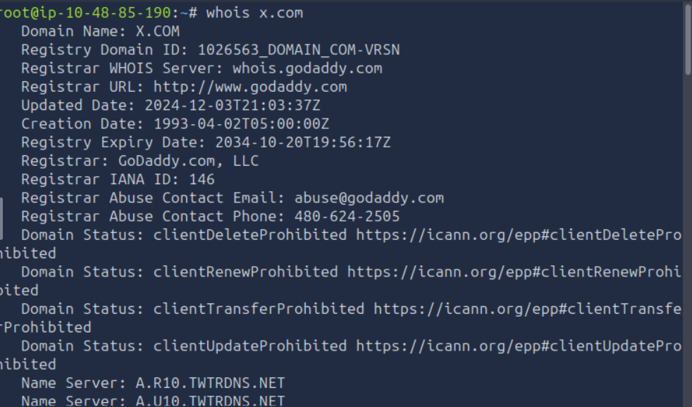
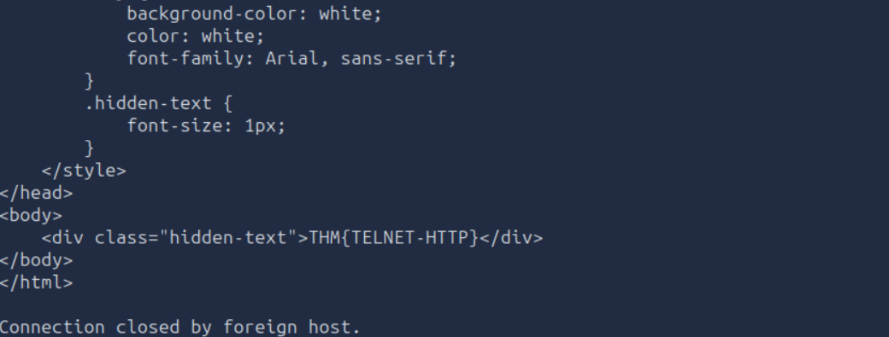

# Networking Core Protocols

## Task 1: Introduction

### Description

We will cover the following protocols:
- WHOIS
- DNS
- HTTP and FTP
- SMTP, POP3, and IMAP

## Task 2: DNS:Remembering Addresses

### Description

- Domain Name System (DNS) is responsible for properly mapping a domain name to an IP address.
- DNS operates at Layer 7 (Application Layer) of ISO OSI model.
- DNS traffic uses UDP port 53 by default and TCP port 53 as a default fallback.
- There are many types of DNS records such as A(maps a hostname to one or more IPv4 addresses), AAAA(maps a hostname to one or more IPv6 addresses), CName(maps a domain name to another domain name) and MX( mail     server responsible for handling emails for a domain).

#### Question

Which DNS record type refers to IPv6?

#### Answer

AAAA

#### Question

Which DNS record type refers to the email server?

#### Answer

MX

## Task 3: WHOIS

### Description

- WHOIS record provides information about the entity that registered a domain name, including name, phone number, email, and address.
- We can also use one of the privacy services that hide all information from the WHOIS records.

#### Question

When was the x.com record created? Provide the answer in YYYY-MM-DD format.

#### Answer

1993-04-02

#### Question

When was the twitter.com record created? Provide the answer in YYYY-MM-DD format.

#### Answer

2000-01-21

## Task 4: HTTP(S) : Accessing the Web

### Description

- HTTP and HTTPS commonly use TCP ports 80 and 443, respectively, and less commonly other ports such as 8080 and 8443.
- Some of the commands or methods that your web browser commonly issues to the web server are: GET, POST, PUT and DELETE.

#### Question

Use telnet to access the file flag.html on 10.48.188.67. What is the hidden flag?

#### Answer

THM{TELNET-HTTP}

