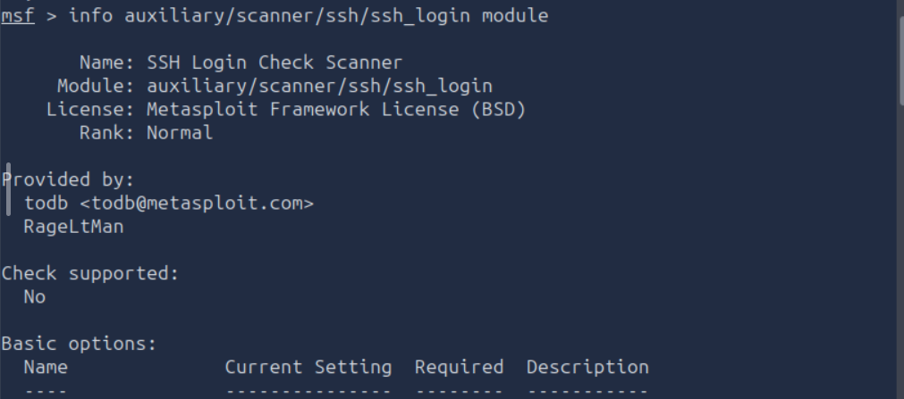

# Metasploit: Introduction

## Task 01: Introduction

### Description

- Metasploit is the most widely used exploitation framework.
- Metasploit is a powerful tool that can support all phases of a penetration testing engagement, from information gathering to post-exploitation.
- The Metasploit Framework is a set of tools that allow information gathering, scanning, exploitation, exploit development, post-exploitation, and more.
- The main components of the Metasploit Framework can be summarized as follows;
    - msfconsole: The main command-line interface.
    - Modules: supporting modules such as exploits, scanners, payloads, etc.
    - Tools: Stand-alone tools that will help vulnerability research, vulnerability assessment, or penetration testing. Some of these tools are msfvenom, pattern_create and pattern_offset.

## Task 02: Main Components of Metasploit

### Description

- Exploit: A piece of code that uses a vulnerability present on the target system.
- Vulnerability: A design, coding, or logic flaw affecting the target system. The exploitation of a vulnerability can result in disclosing confidential information or allowing the attacker to execute code on the    target system.
- Payload: An exploit will take advantage of a vulnerability. However, if we want the exploit to have the result we want (gaining access to the target system, read confidential information, etc.), we need to use
  a payload. Payloads are the code that will run on the target system.
- Auxiliary: Any supporting module, such as scanners, crawlers and fuzzers, can be found here.
- Encoders: Encoders will allow you to encode the exploit and payload in the hope that a signature-based antivirus solution may miss them.
- Evasion: While encoders will encode the payload, they should not be considered a direct attempt to evade antivirus software. On the other hand, “evasion” modules will try that, with more or less success.
- NOPs: NOPs (No OPeration) do nothing, literally. They are represented in the Intel x86 CPU family with 0x90, following which the CPU will do nothing for one cycle. They are often used as a buffer to achieve consistent payload sizes.
- POST: Post modules will be useful on the final stage of the penetration testing process listed above, post-exploitation.
- Four different directories under payloads: adapters, singles, stagers and stages.
    - Adapters: An adapter wraps single payloads to convert them into different formats. For example, a normal single payload can be wrapped inside a Powershell adapter, which will make a single powershell command that will execute the payload.
    - Singles: Self-contained payloads (add user, launch notepad.exe, etc.) that do not need to download an additional component to run.
    - Stagers: Responsible for setting up a connection channel between Metasploit and the target system. Useful when working with staged payloads. “Staged payloads” will first upload a stager on the target system then download the rest of the payload (stage). This provides some advantages as the initial size of the payload will be relatively small compared to the full payload sent at once.
    - Stages: Downloaded by the stager. This will allow you to use larger sized payloads.

#### Question

What is the name of the code taking advantage of a flaw on the target system?

#### Answer

Exploit

#### Question

What is the name of the code that runs on the target system to achieve the attacker's goal?

#### Answer

Payload

#### Question

What are self-contained payloads called?

#### Answer

Singles

#### Question

Is "windows/x64/pingback_reverse_tcp" among singles or staged payload?

#### Answer

Singles

## Task 03: Msfconsole

### Description

- history command to see commands typed earlier.
- Once you type the use exploit/windows/smb/ms17_010_eternalblue command, you will see the command line prompt change from msf6 to “msf6 exploit(windows/smb/ms17_010_eternalblue)”. The "EternalBlue" is an exploit allegedly developed by the U.S. National Security Agency (N.S.A.) for a vulnerability affecting the SMBv1 server on numerous Windows systems. The SMB (Server Message Block) is widely used in Windows networks for file sharing and even for sending files to printers.
- The prompt tells us we now have a context set in which we will work. You can see this by typing the show options command.
- The show command can be used in any context followed by a module type (auxiliary, payload, exploit, etc.) to list available modules. The example below lists payloads that can be used with the ms17-010 Eternalblue exploit.
- Further information on any module can be obtained by typing the info command within its context.
- One of the most useful commands in msfconsole is search. This command will search the Metasploit Framework database for modules relevant to the given search parameter. You can conduct searches using CVE numbers, exploit names (eternalblue, heartbleed, etc.), or target system.
- Another essential piece of information returned is in the “rank” column. Exploits are rated based on their reliability.

#### Question

How would you search for a module related to Apache?

#### Answer

search apache

#### Question

Who provided the auxiliary/scanner/ssh/ssh_login module?

#### Answer

todb

## Task 04: Working with Modules

### Description

- Get a context prompt for the desired module.
- The show options command will list all available parameters.
- Set the RHOSTS parameter to the IP address of our target system using the set command.
- You can override any set parameter using the set command again with a different value. You can also clear any parameter value using the unset command or clear all set parameters with the unset all command.
- You can use the setg command to set values that will be used for all modules.
- The exploit command can be used without any parameters or using the “-z” parameter.
- You can use the background command to background the session prompt and go back to the msfconsole prompt.
- The sessions command can be used from the msfconsole prompt or any context to see the existing sessions.
- To interact with any session, you can use the sessions -i command followed by the desired session number.

#### Question

How would you set the LPORT value to 6666?

#### Answer

set LPORT 6666

#### Question

How would you set the global value for RHOSTS  to 10.10.19.23 ?

#### Answer

setg RHOSTS 10.10.19.23

#### Question

What command would you use to clear a set payload?

#### Answer

unset PAYLOAD

#### Question

What command do you use to proceed with the exploitation phase?

#### Answer

exploit

