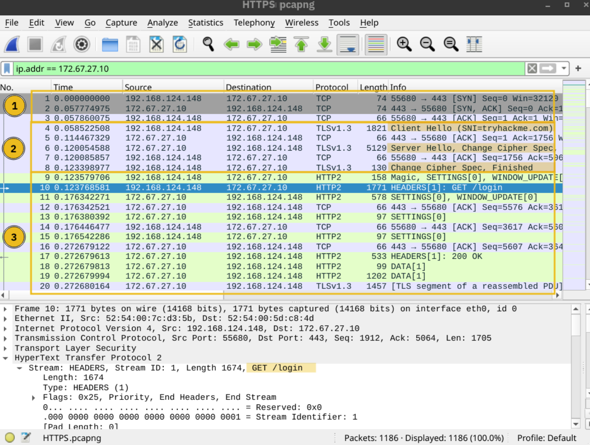
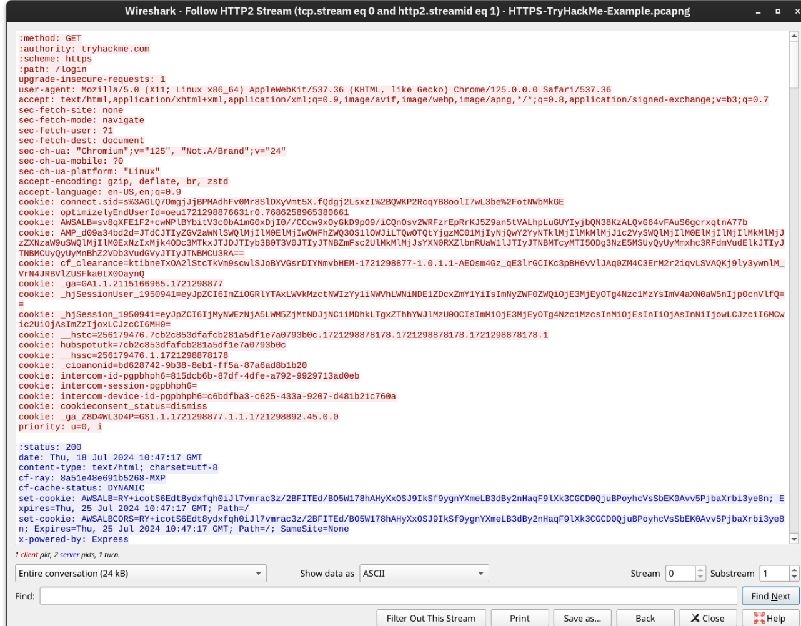

# Networking Secure Protocols

## Task 01: Introduction

### Description

- Transport Layer Security (TLS) is added to existing protocols to protect communication confidentiality, integrity, and authenticity. Consequently, HTTP, POP3, SMTP, and IMAP become HTTPS, POP3S, SMTPS, and IMAPS, where the appended “S” stands for Secure.
- It is deemed insecure to remotely access a system using the TELNET protocol; Secure Shell (SSH) was created to provide a secure way to access remote systems.

## Task 02: TLS

### Description

- Like SSL, its predecessor, TLS is a cryptographic protocol operating at the OSI model’s transport layer.
-  TLS ensures that no one can read or modify the exchanged data.

#### Question

What is the protocol name that TLS upgraded and built upon?

#### Answer

SSL

#### Question

Which type of certificates should not be used to confirm the authenticity of a server?

#### Answer

self-signed certificate

## Task 03: HTTPS

### Description

- HTTPS stands for Hypertext Transfer Protocol Secure. It is basically HTTP over TLS.
- Adding TLS to HTTP leads to all the packets being encrypted. We can no longer see the contents of the exchanged packets unless we get access to the private key.

  
#### Question

How many packets did the TLS negotiation and establishment take in the Wireshark HTTPS screenshots above?

#### Answer

8

#### Question

What is the number of the packet that contain the GET /login when accessing the website over HTTPS?

#### Answer

10
