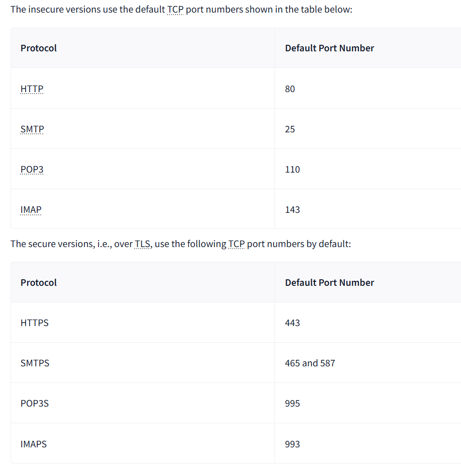
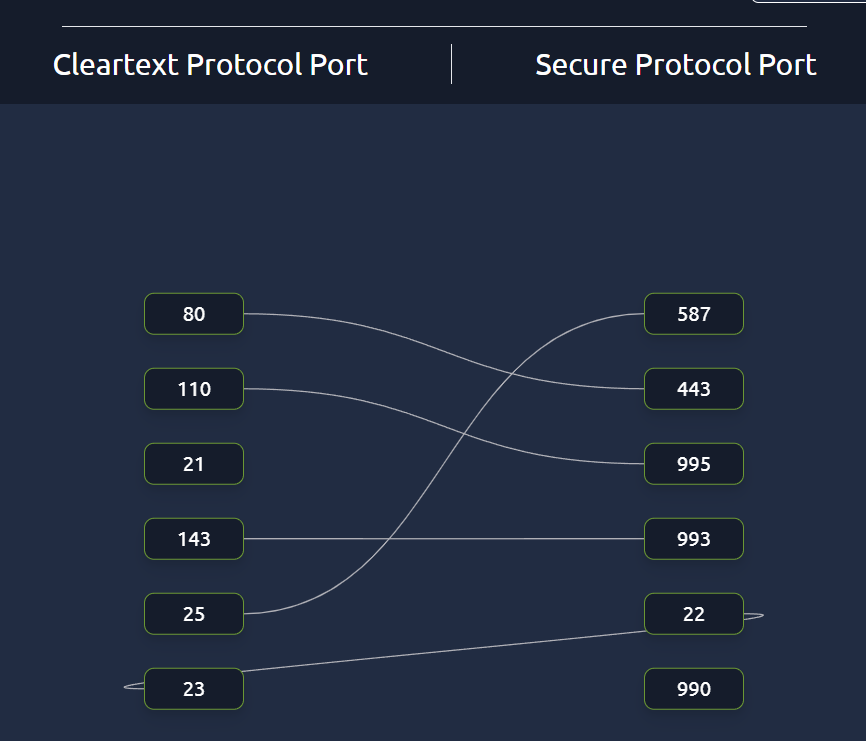
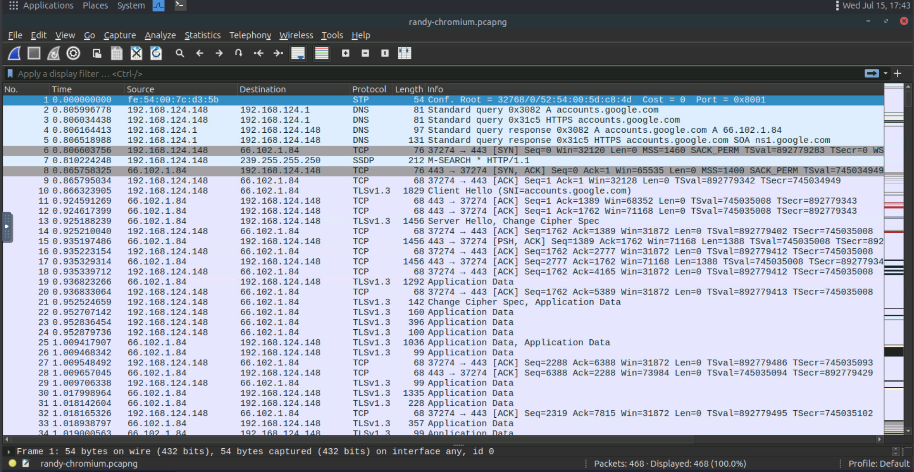
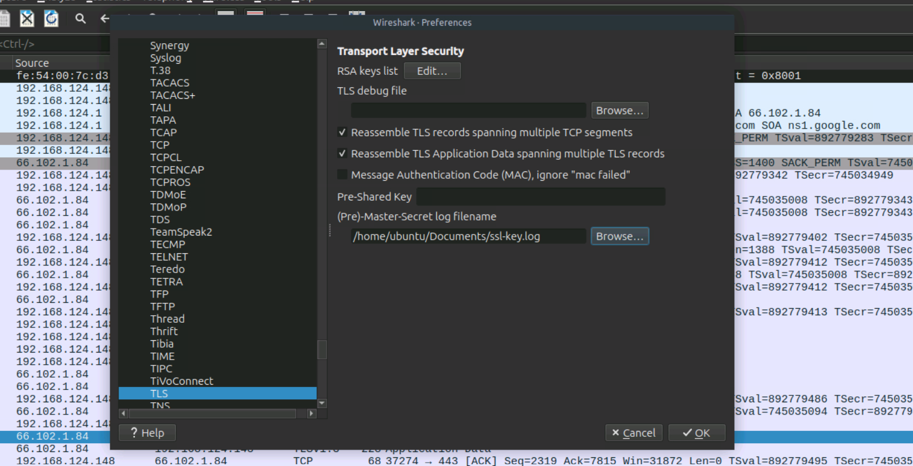
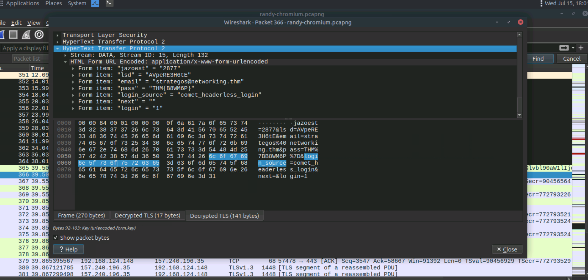

# Networking Secure Protocols

## Task 01: Introduction

### Description

- Transport Layer Security (TLS) is added to existing protocols to protect communication confidentiality, integrity, and authenticity. Consequently, HTTP, POP3, SMTP, and IMAP become HTTPS, POP3S, SMTPS, and IMAPS, where the appended “S” stands for Secure.
- It is deemed insecure to remotely access a system using the TELNET protocol; Secure Shell (SSH) was created to provide a secure way to access remote systems.

## Task 02: TLS

### Description

- Like SSL, its predecessor, TLS is a cryptographic protocol operating at the OSI model’s transport layer.
-  TLS ensures that no one can read or modify the exchanged data.

#### Question

What is the protocol name that TLS upgraded and built upon?

#### Answer

SSL

#### Question

Which type of certificates should not be used to confirm the authenticity of a server?

#### Answer

self-signed certificate

## Task 03: HTTPS

### Description

- HTTPS stands for Hypertext Transfer Protocol Secure. It is basically HTTP over TLS.
- Adding TLS to HTTP leads to all the packets being encrypted. We can no longer see the contents of the exchanged packets unless we get access to the private key.

  
#### Question

How many packets did the TLS negotiation and establishment take in the Wireshark HTTPS screenshots above?

#### Answer

8

#### Question

What is the number of the packet that contain the GET /login when accessing the website over HTTPS?

#### Answer

10

## Task 04: SMTPS,P0P3S. and IMAPS

### Description

- Adding TLS to SMTP, POP3, and IMAP is no different than adding TLS to HTTP.

  
#### Question

If you capture network traffic, in which of the following protocols can you extract login credentials: SMTPS, POP3S, or IMAP?

#### Answer

IMAP

## Task 05: SSH

### Description

- Benefits of OpenSSH includes: Secure authentication, Confidentiality, Integrity, Tunneling, X11 Forwarding.
- While the TELNET server listens on port 23, the SSH server listens on port 22.
  
#### Question

What is the name of the open-source implementation of the SSH protocol?

#### Answer

OpenSSH

## Task 06: SFTP and FTPS

### Description

- SFTP stands for SSH File Transfer Protocol and allows secure file transfer. It is part of the SSH protocol suite and shares the same port number, 22.
- FTPS requires a proper TLS certificate to run securely.While FTP uses port 21, FTPS usually uses port 990.

  
#### Question

Click on the View Site button to access the related site. Please follow the instructions on the site to obtain the flag.

#### Answer

THM{Protocols_secur3d}

## Task 07: VPN

### Description

- Once a VPN tunnel is established, all our Internet traffic will usually be routed over the VPN connection, i.e. via the VPN tunnel.
- Depending on why you are using a VPN connection, you might need to run a few more tests, such as a DNS leak test.

  
#### Question

What would you use to connect the various company sites so that users at a remote office can access resources located within the main branch?

#### Answer

VPN

## Task 08: Closing Notes

### Description
  
#### Question

One of the packets contains login credentials. What password did the user submit?

#### Answer

THM{B8WM6P}

