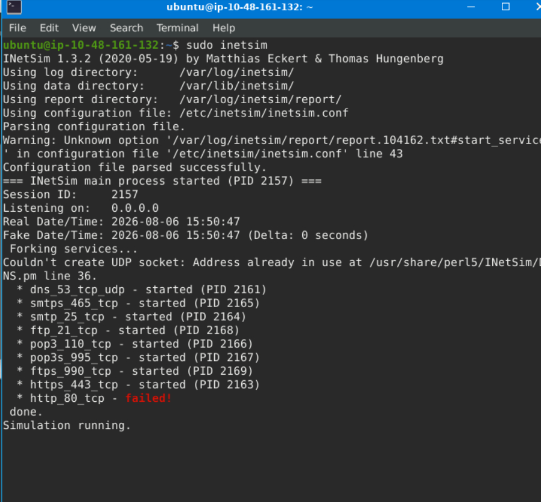
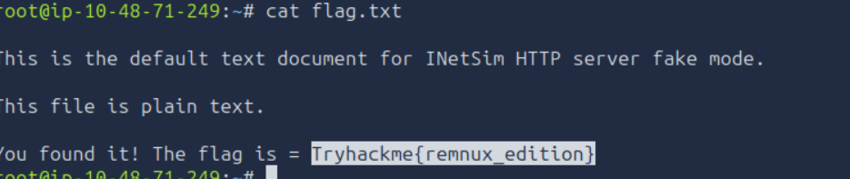
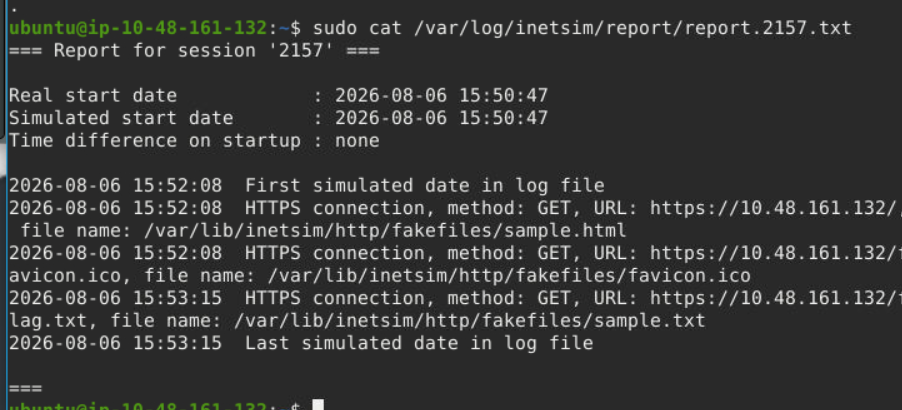
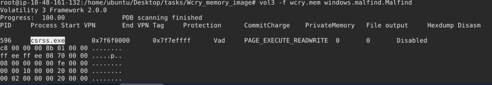
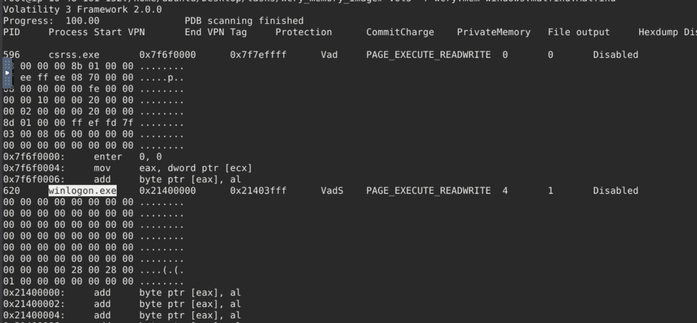
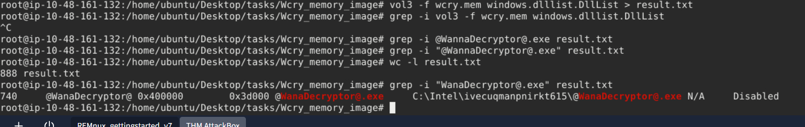

# REMnux: Getting Started

## Task 01: Introduction

### Description

- The REMnux VM is a specialised Linux distro. It already includes tools like Volatility, YARA, Wireshark, oledump, and INetSim.
- It also provides a sandbox-like environment for dissecting potentially malicious software without risking your primary system.

## Task 02: Machine Access

### Description

- Starting Tryhackme attacker machine and lab machine.

## Task 03: File Analysis

### Description

- In this task, we will use oledump.py to conduct static analysis on a potentially malicious Excel document.
- Oledump.py is a Python tool that analyzes OLE2 files, commonly called Structured Storage or Compound File Binary Format. OLE stands for Object Linking and Embedding.
- Run the command oledump.py agenttesla.xlsm

- Here A4 means : stream number 4 inside xl/vbaProject.bin
- Uppercase M means: This stream contains VBA Macro code.
- Lowercase m usually means something different.
- The results above are in hex dump format.We will run an additional parameter --vbadecompress in addition to the previous command. When we use this parameter, oledump will automatically decompress any compressed VBA macros it finds into a more readable format, making it easier to analyze the contents of the macros.

- We will copy the first value of Sqtnew and paste it into CyberChef's input area.

#### Question

What Python tool analyzes OLE2 files, commonly called Structured Storage or Compound File Binary Format?

#### Answer

oledump.py

#### Question

What tool parameter we used in this task allows you to select a particular data stream of the file we are using it with?

#### Answer

-s

#### Question

During our analysis, we were able to decode a PowerShell script. What command is commonly used for downloading files from the internet?

#### Answer

Invoke-WebRequest

#### Question

What file was being downloaded using the PowerShell script?

#### Answer

Doc-3737122pdf.exe

#### Question

During our analysis of the PowerShell script, we noted that a file would be downloaded. Where will the file being downloaded be stored?

#### Answer

$TempFile

#### Question

Using the tool, scan another file named possible_malicious.docx located in the /home/ubuntu/Desktop/tasks/agenttesla/ directory. How many data streams were presented for this file?

#### Answer

16

#### Question

Using the tool, scan another file named possible_malicious.docx located in the /home/ubuntu/Desktop/tasks/agenttesla/ directory. At what data stream number does the tool indicate a macro present?

#### Answer

8

## Task 04: Fake Network to Aid Analysis

### Description

- INetSim: Internet Services Simulation Suite!
- Change the INetSim configuration by running this command sudo nano /etc/inetsim/inetsim.conf and look for the value #dns_default_ip 0.0.0.0.
- Remove the comment or #, then change the value of dns_default_ip from 0.0.0.0 to the machine’s IP address.
- Run the command sudo inetsim to start the tool.
- One usual malware behaviour is downloading another binary or script. We will try to mimic this behaviour by getting another file from INetsim. 

#### Question

Download and scan the file named flag.txt from the terminal using the command sudo wget https://MACHINE_IP/flag.txt --no-check-certificate. What is the flag?

#### Answer

Tryhackme{remnux_edition}

#### Question

After stopping the inetsim, read the generated report. Based on the report, what URL Method was used to get the file flag.txt?

#### Answer

GET

## Task 05: Memory Investigation: Evidence Preprocessing

### Description

- One of the most common investigative practices in Digital Forensics is the preprocessing of evidence.
- In your RemnuxVM, run sudo su, then navigate to /home/ubuntu/Desktop/tasks/Wcry_memory_image/ directory, and our file would be wcry.mem. We will run each plugin after the command vol3 -f wcry.mem.
- PsTree:  vol3 -f wcry.mem windows.pstree.PsTree
- PsList:  vol3 -f wcry.mem windows.pslist.PsList
- CmdLine:  vol3 -f wcry.mem windows.cmdline.CmdLine
- FileScan: vol3 -f wcry.mem windows.filescan.FileScan
- DllList:  vol3 -f wcry.mem windows.dlllist.DllList
- PsScan:  vol3 -f wcry.mem windows.psscan.PsScan
- Malfind: vol3 -f wcry.mem windows.malfind.Malfind
- https://volatility3.readthedocs.io/en/stable/volatility3.plugins.html
- Investigative practices involves preprocessing evidence and saving the results to text files: for plugin in windows.malfind.Malfind windows.psscan.PsScan windows.pstree.PsTree windows.pslist.PsList windows.cmdline.CmdLine windows.filescan.FileScan windows.dlllist.DllList; do vol3 -q -f wcry.mem $plugin > wcry.$plugin.txt; done
  

#### Question

What plugin lists processes in a tree based on their parent process ID?

#### Answer

PsTree

#### Question

What plugin is used to list all currently active processes in the machine?

#### Answer

PsList

#### Question

What Linux utility tool can extract the ASCII, 16-bit little-endian, and 16-bit big-endian strings?

#### Answer

strings

#### Question

By running vol3 with the Malfind parameter, what is the first (1st) process identified suspected of having an injected code?

#### Answer

csrss.exe

#### Question

Continuing from the previous question (Question 4), what is the second (2nd) process identified suspected of having an injected code?

#### Answer

winlogon.exe

#### Question

By running vol3 with the DllList parameter, what is the file path or directory of the binary @WanaDecryptor@.exe?

#### Answer

C:\Intel\ivecuqmanpnirkt615

