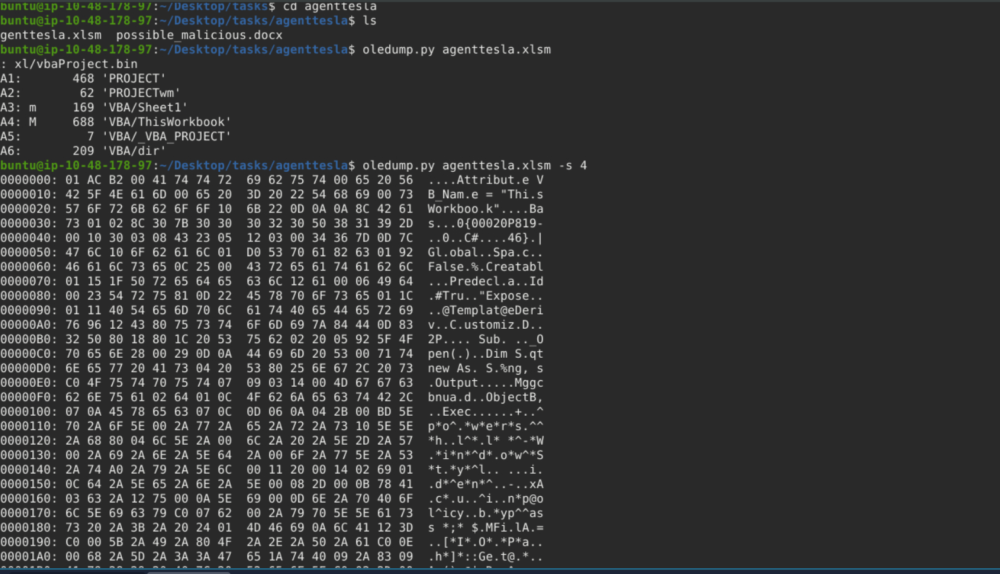
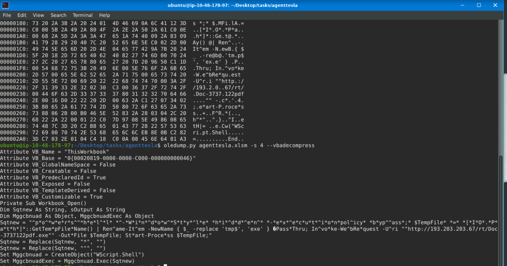
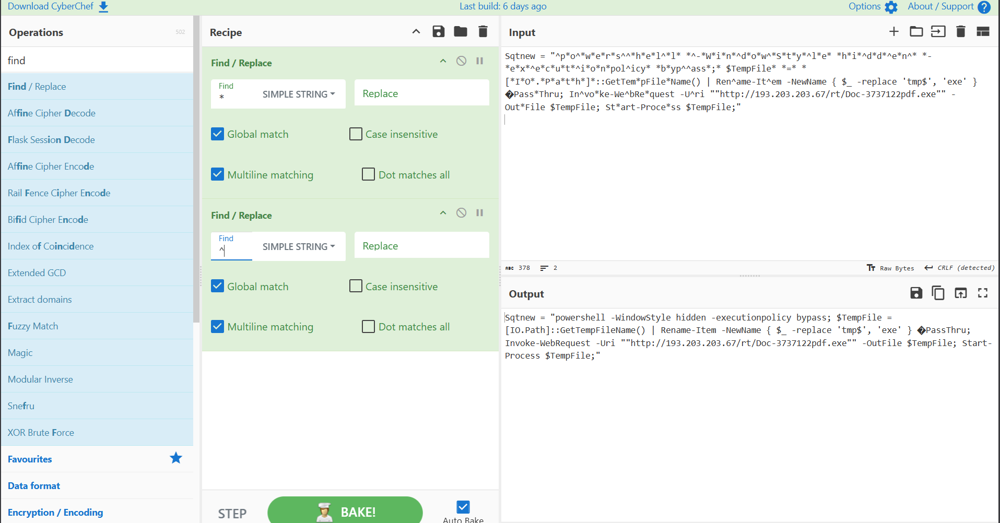
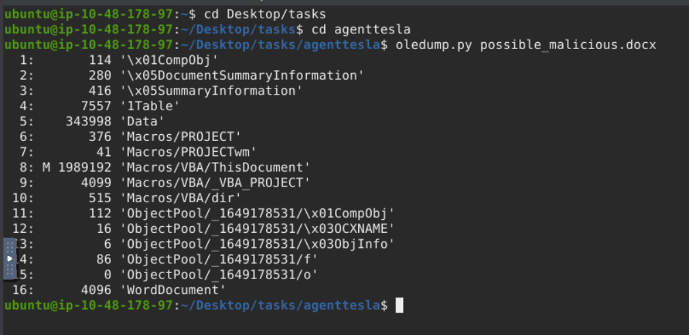

# REMnux: Getting Started

## Task 01: Introduction

### Description

- The REMnux VM is a specialised Linux distro. It already includes tools like Volatility, YARA, Wireshark, oledump, and INetSim.
- It also provides a sandbox-like environment for dissecting potentially malicious software without risking your primary system.

## Task 02: Machine Access

### Description

- Starting Tryhackme attacker machine and lab machine.

## Task 03: File Analysis

### Description

- In this task, we will use oledump.py to conduct static analysis on a potentially malicious Excel document.
- Oledump.py is a Python tool that analyzes OLE2 files, commonly called Structured Storage or Compound File Binary Format. OLE stands for Object Linking and Embedding.
- Run the command oledump.py agenttesla.xlsm

- Here A4 means : stream number 4 inside xl/vbaProject.bin
- Uppercase M means: This stream contains VBA Macro code.
- Lowercase m usually means something different.
- The results above are in hex dump format.We will run an additional parameter --vbadecompress in addition to the previous command. When we use this parameter, oledump will automatically decompress any compressed VBA macros it finds into a more readable format, making it easier to analyze the contents of the macros.

- We will copy the first value of Sqtnew and paste it into CyberChef's input area.

#### Question

What Python tool analyzes OLE2 files, commonly called Structured Storage or Compound File Binary Format?

#### Answer

oledump.py

#### Question

What tool parameter we used in this task allows you to select a particular data stream of the file we are using it with?

#### Answer

-s

#### Question

During our analysis, we were able to decode a PowerShell script. What command is commonly used for downloading files from the internet?

#### Answer

Invoke-WebRequest

#### Question

What file was being downloaded using the PowerShell script?

#### Answer

Doc-3737122pdf.exe

#### Question

During our analysis of the PowerShell script, we noted that a file would be downloaded. Where will the file being downloaded be stored?

#### Answer

$TempFile

#### Question

Using the tool, scan another file named possible_malicious.docx located in the /home/ubuntu/Desktop/tasks/agenttesla/ directory. How many data streams were presented for this file?

#### Answer

16

#### Question

Using the tool, scan another file named possible_malicious.docx located in the /home/ubuntu/Desktop/tasks/agenttesla/ directory. At what data stream number does the tool indicate a macro present?

#### Answer

8
