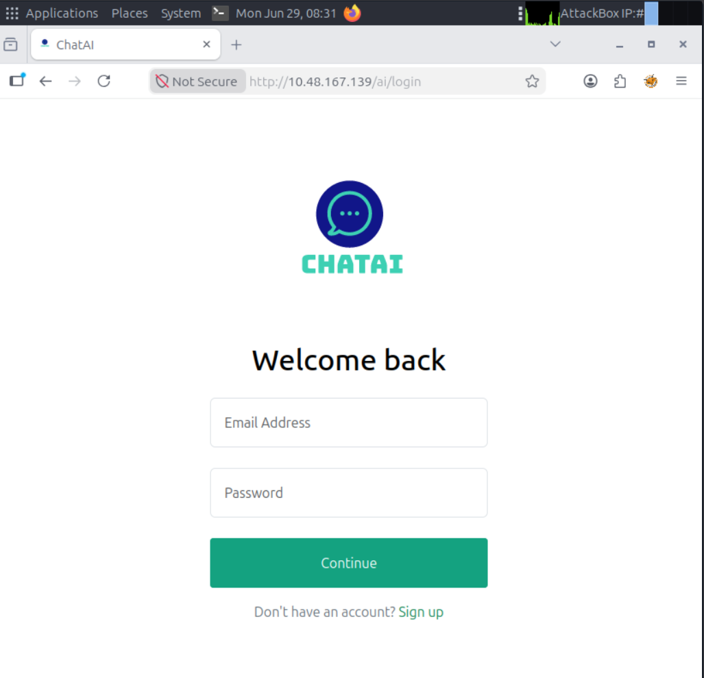
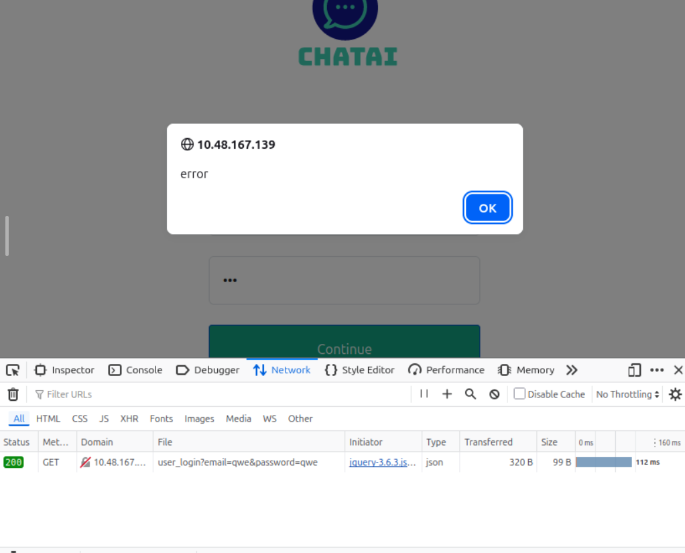
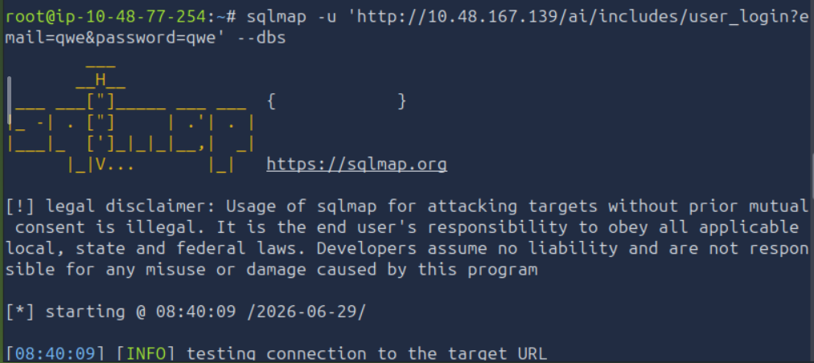
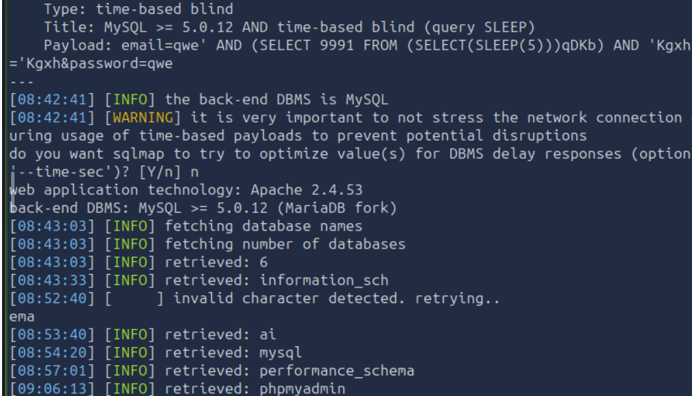
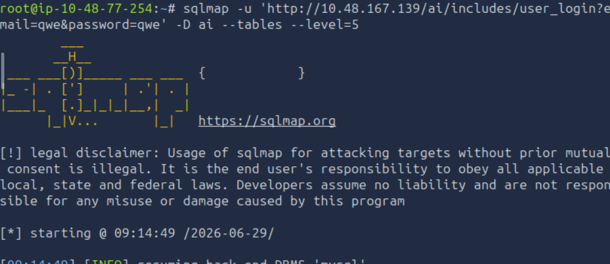
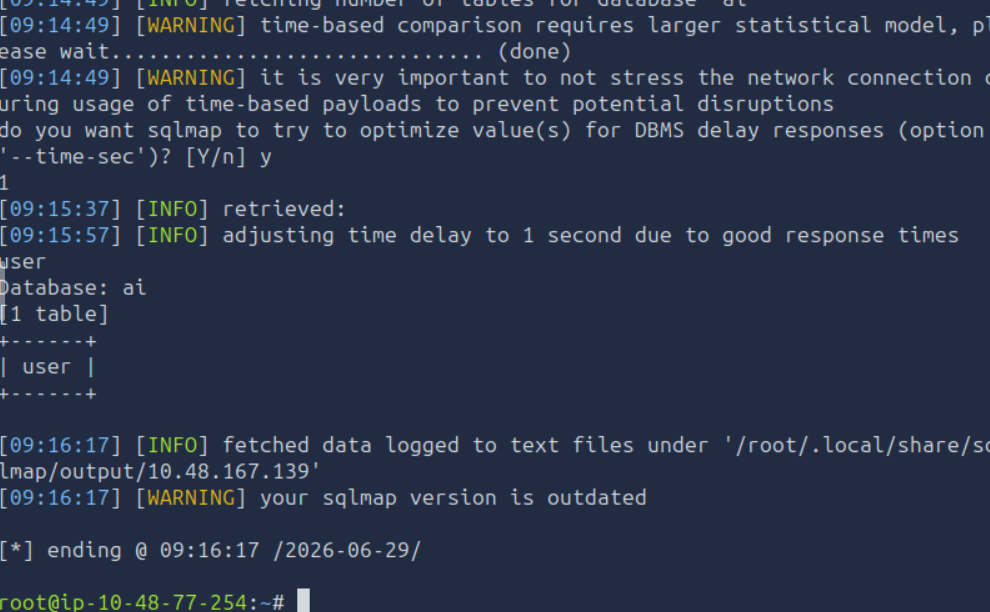
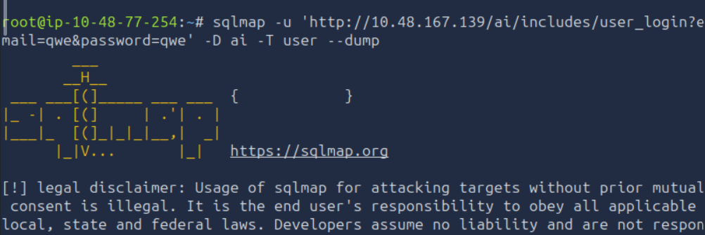
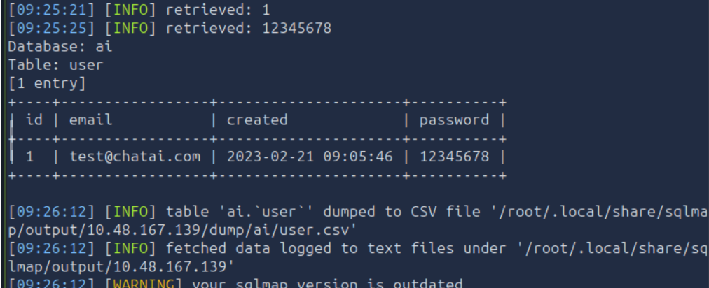

# SQLMap: The Basics 

## Task 01: Introduction

-  The databases are managed by Database Management Systems (DBMS), such as MySQL, PostgreSQL, SQLite, or Microsoft SQL Server.
-  These systems understand the Structured Query Language (SQL).

### Question

Which language builds the interaction between a website and its database?

### Answer

SQL

## Task 02: SQL Injection Vulnerability

- Taking an example of login page, once we enter username and password, the website will receive it, make an SQL query with credentials, and send it to the database.
- Username: John ,  Password: Un@detectable444
- SELECT * FROM users WHERE username = 'John' AND password = 'Un@detectable444';
- Attackers can manipulate the input and write SQL queries that would get executed in the database and perform the attacker’s desired actions.
- Username: John , Password: abc' OR 1=1;-- -
- SELECT * FROM users WHERE username = 'John' AND password = 'abc' OR 1=1;-- -';
  
### Question

Which boolean operator checks if at least one side of the operator is true for the condition to be true?

### Answer

OR

### Question

Is 1=1 in an SQL query always true? (YEA/NAY)

### Answer

YEA

## Task 03: Automated SQL Injection Tool

- SQLMap is an automated tool for detecting and exploiting SQL injection vulnerabilities in web applications.
- The --help command with SQLMap will list all the available flags.
- The --wizard flag  will guide through each step and ask questions to complete the scan, making it a good choice for beginners.
- The --dbs flag extract all the database names.
- To extract the information of database use -D database_name --tables.
- To enumerate records in a table use -D database_name -T table_name --dump.
- If any web application is using GET parameters in the URLs to retrieve data, test that URL with the -u flag in the SQLMap tool.
- After logging into an application via a browser and capturing the session cookie, pass it to SQLMap using --cookie="SESSIONID=abcdef123456" to accurately test injection points that are only reachable after authentication.
- 

### Question

Which flag in the SQLMap tool is used to extract all the databases available?

### Answer

--dbs

### Question

What would be the full command of SQLMap for extracting all tables from the "members" database? (Vulnerable URL: http://sqlmaptesting.thm/search/cat=1)

### Answer

sqlmap -u http://sqlmaptesting.thm/search/cat=1 -D members --tables

## Task 04: Practical

  
### Question

How many databases are available in this web application?

### Answer

6

### Question

What is the name of the table available in the "ai" database?

### Answer

user

### Question

What is the password of the email test@chatai.com?

### Answer

12345678

