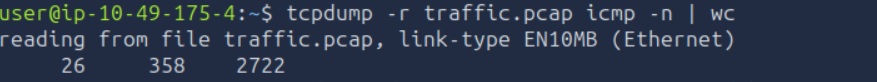
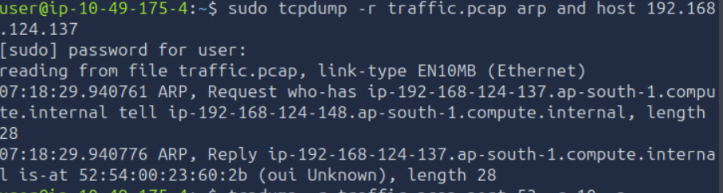
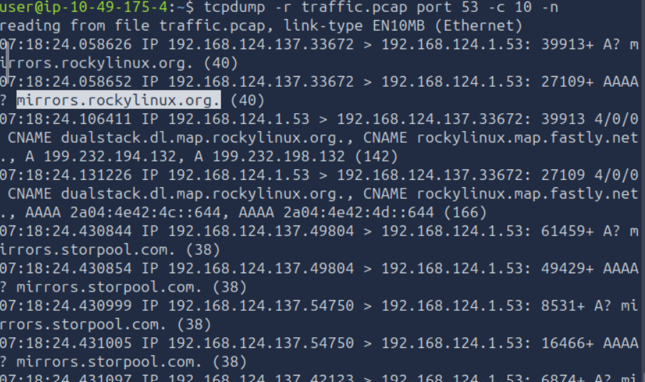
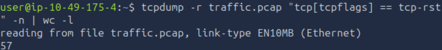
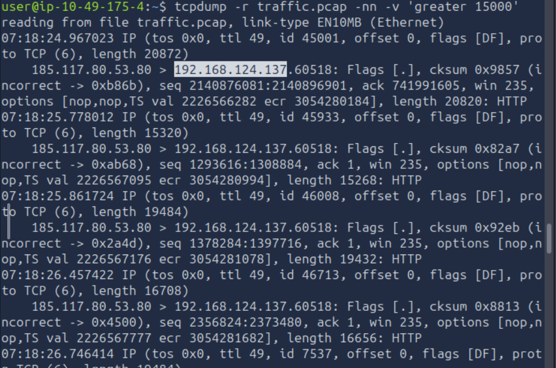
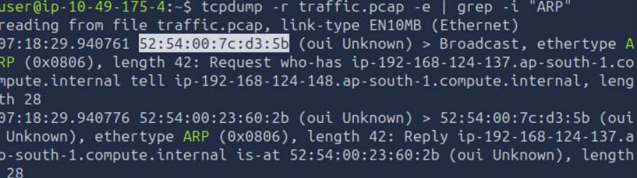

# Tcpdump: The Basics

## Task 01: Introduction

### Description

-  The Tcpdump tool and its libpcap library are written in C and C++
-  Moreover, it was ported to MS Windows as winpcap.

#### Question

What is the name of the library that is associated with tcpdump?

#### Answer

libpcap

## Task 02: Basic Packet Capture

### Description

- The first thing to decide is which network interface to listen to using -i INTERFACE. You can choose to listen on all available interfaces using -i any; alternatively, you can specify an interface you want to listen on, such as -i eth0.
- A command such as ip address show (or merely ip a s) would list the available network interfaces.
- In many cases, you should check the captured packets again later. This can be achieved by saving to a file using -w FILE. The file extension is most commonly set to .pcap. The saved packets can be inspected later using another program, such as Wireshark. You won’t see the packets scrolling when you choose the -w option.
- You can use Tcpdump to read packets from a file by using -r FILE.
- You can specify the number of packets to capture by specifying the count using -c COUNT.
- tcpdump -n	Don’t resolve IP addresses
- tcpdump -nn	Don’t resolve IP addresses and don’t resolve protocol numbers
- tcpdump -v	Verbose display; verbosity can be increased with -vv and -vvv

#### Question

What option can you add to your command to display addresses only in numeric format?

#### Answer

-n

## Task 03: Filtering Expressions

### Description

- Let’s say you are only interested in IP packets exchanged with your network printer or a specific game server. You can easily limit the captured packets to this host using host IP or host HOSTNAME.
- If you want to limit the packets to those from a particular source IP address or hostname, you must use src host IP or src host HOSTNAME.
- imilarly, you can limit packets to those sent to a specific destination using dst host IP or dst host HOSTNAME.
- You can limit your packet capture to a specific protocol; examples include: ip, ip6, udp, tcp, and icmp. 

#### Question

How many packets in traffic.pcap use the ICMP protocol?

#### Answer

26

#### Question

What is the IP address of the host that asked for the MAC address of 192.168.124.137?

#### Answer

192.168.124.148

#### Question

What hostname (subdomain) appears in the first DNS query?

#### Answer

mirrors.rockylinux.org.

## Task 04: Advanced Filtering

### Description

- greater LENGTH: Filters packets that have a length greater than or equal to the specified length
- less LENGTH: Filters packets that have a length less than or equal to the specified length
- You can use tcp[tcpflags] to refer to the TCP flags field. The following TCP flags are available to compare with:
    - tcp-syn TCP SYN (Synchronize)
    - tcp-ack TCP ACK (Acknowledge)
    - tcp-fin TCP FIN (Finish)
    - tcp-rst TCP RST (Reset)
    - tcp-push TCP Push

#### Question

How many packets have only the TCP Reset (RST) flag set?

#### Answer

57

#### Question

What is the IP address of the host that sent packets larger than 15000 bytes?

#### Answer

185.117.80.53

## Task 05: Displaying Packets

### Description

- Tcpdump is a rich program with many options to customize how the packets are printed and displayed. We have selected to cover the following five options:
    - -q: Quick output; print brief packet information
    - -e: Print the link-level header/ Include MAC addresses
    - -A: Show packet data in ASCII
    - -xx: Show packet data in hexadecimal format, referred to as hex
    - -X: Show packet headers and data in hex and ASCII

#### Question

What is the MAC address of the host that sent an ARP request?

#### Answer

52:54:00:7c:d3:5b
