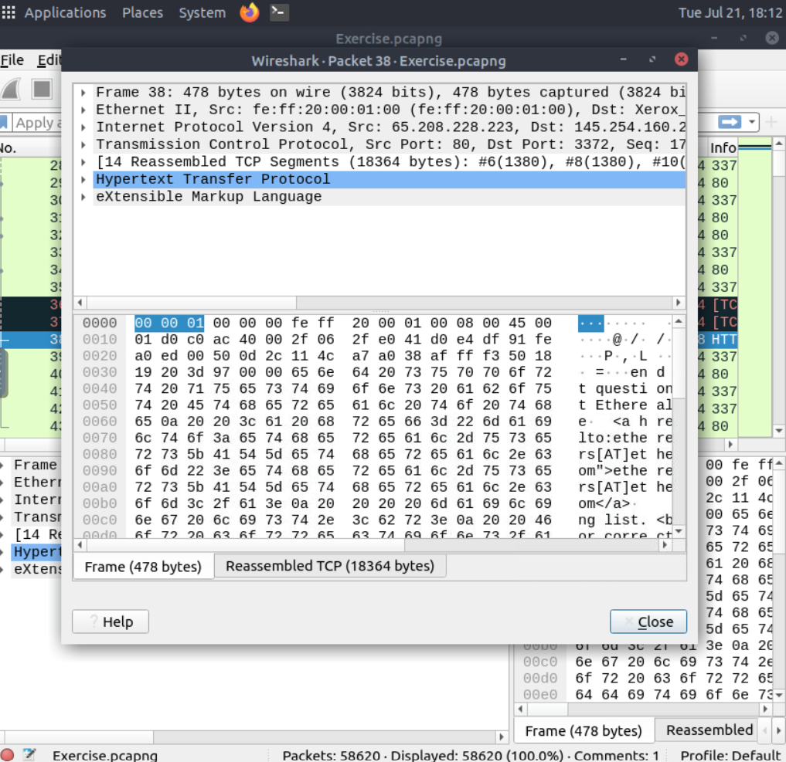
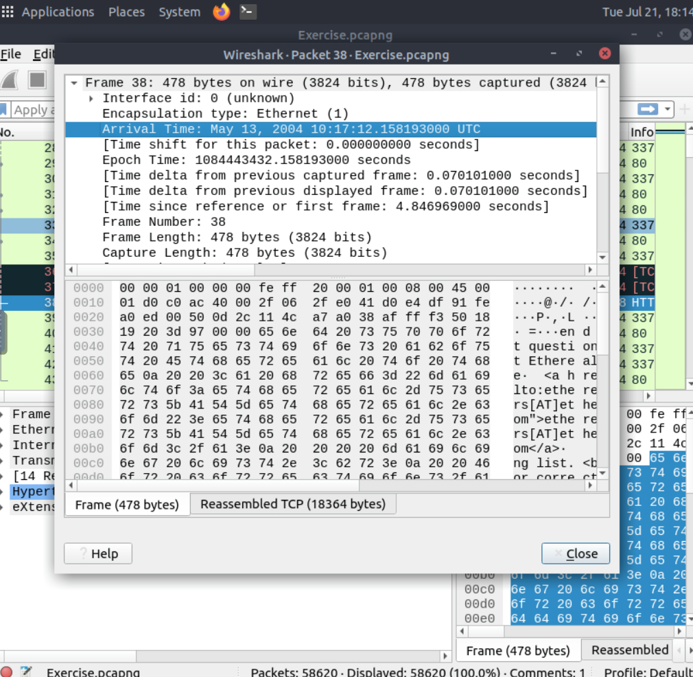
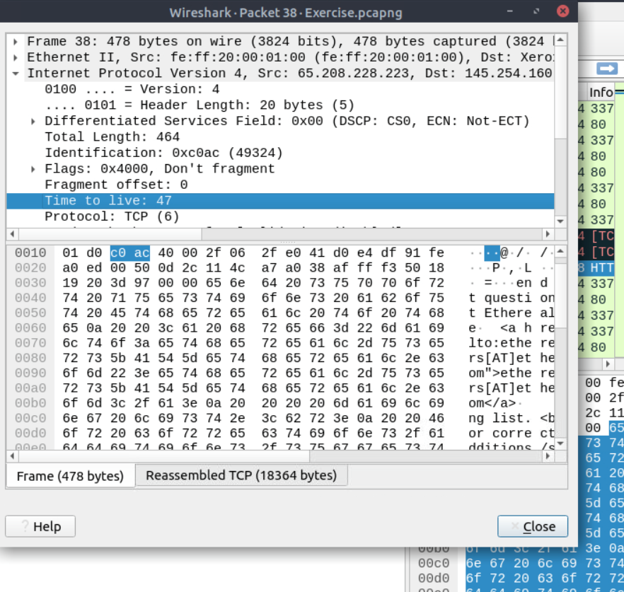
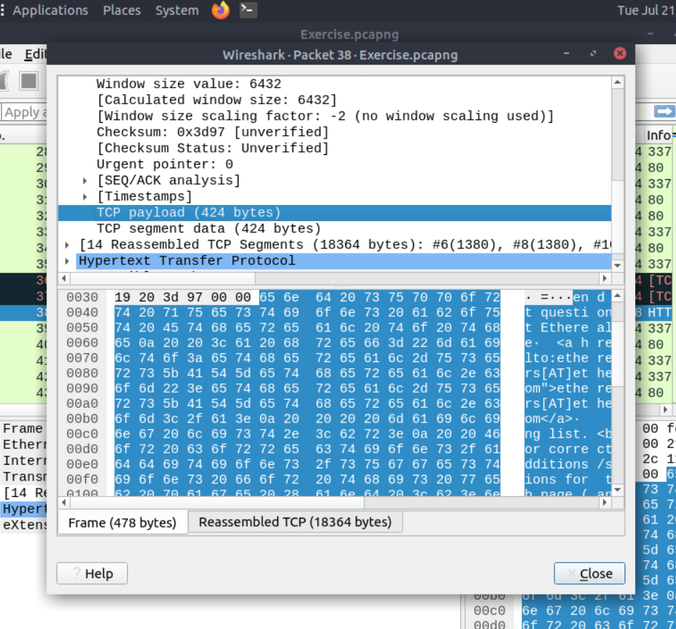
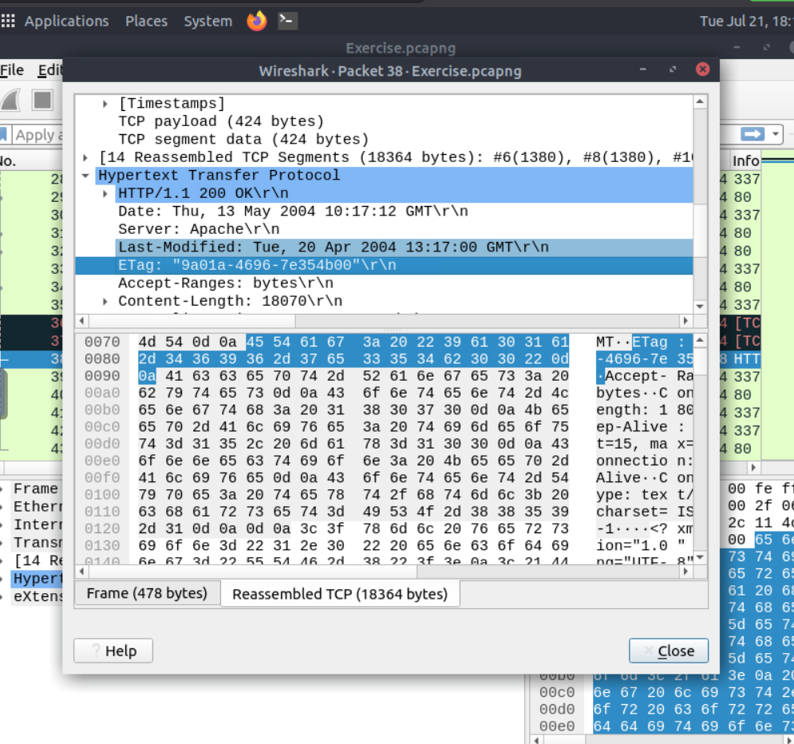

# Wireshark: The Basics

## Task 01: Introduction

### Description

- Wireshark is an open-source, cross-platform network packet analyser tool capable of sniffing and investigating live traffic and inspecting packet captures (PCAP).

#### Question

Which file is used to simulate the screenshots?

#### Answer

http1.pcapng

#### Question

Which file is used to answer the questions?

#### Answer

Exercise.pcapng

## Task 02: Tool Overview

### Description

- Wireshark can be used for multiple purposes, such as:
  
1. Detecting and troubleshooting network problems, such as network load failure points and congestion.
2. Detecting security anomalies, such as rogue hosts, abnormal port usage, and suspicious traffic.
3. Investigating and learning protocol details, such as response codes and payload data.

- Wireshark is not an Intrusion Detection System (IDS). It only allows analysts to discover and investigate the packets in depth.

#### Question

Use the "Exercise.pcapng" file to answer the questions.
Read the "capture file comments". What is the flag?

#### Answer

TryHackMe_Wireshark_Demo

#### Question

What is the total number of packets?

#### Answer

58620

#### Question

What is the SHA256 hash value of the capture file?

#### Answer

f446de335565fb0b0ee5e5a3266703c778b2f3dfad7efeaeccb2da5641a6d6eb

## Task 03: Packet Dissection

### Description

- Packet dissection is also known as protocol dissection, which investigates packet details by decoding available protocols and fields.
- https://github.com/boundary/wireshark/blob/master/doc/README.dissector

#### Question

Use the "Exercise.pcapng" file to answer the questions. View packet number 38. Which markup language is used under the HTTP protocol?

#### Answer

eXtensible Markup Language

#### Question

What is the arrival date of the packet? (Answer format: Month/Day/Year)

#### Answer

05/13/2004

#### Question

What is the TTL value?

#### Answer

47

#### Question

What is the TCP payload size?

#### Answer

424

#### Question

What is the e-tag value?
(For example: 82ecb-6321-9e904585)

#### Answer

9a01a-4696-7e354b00

